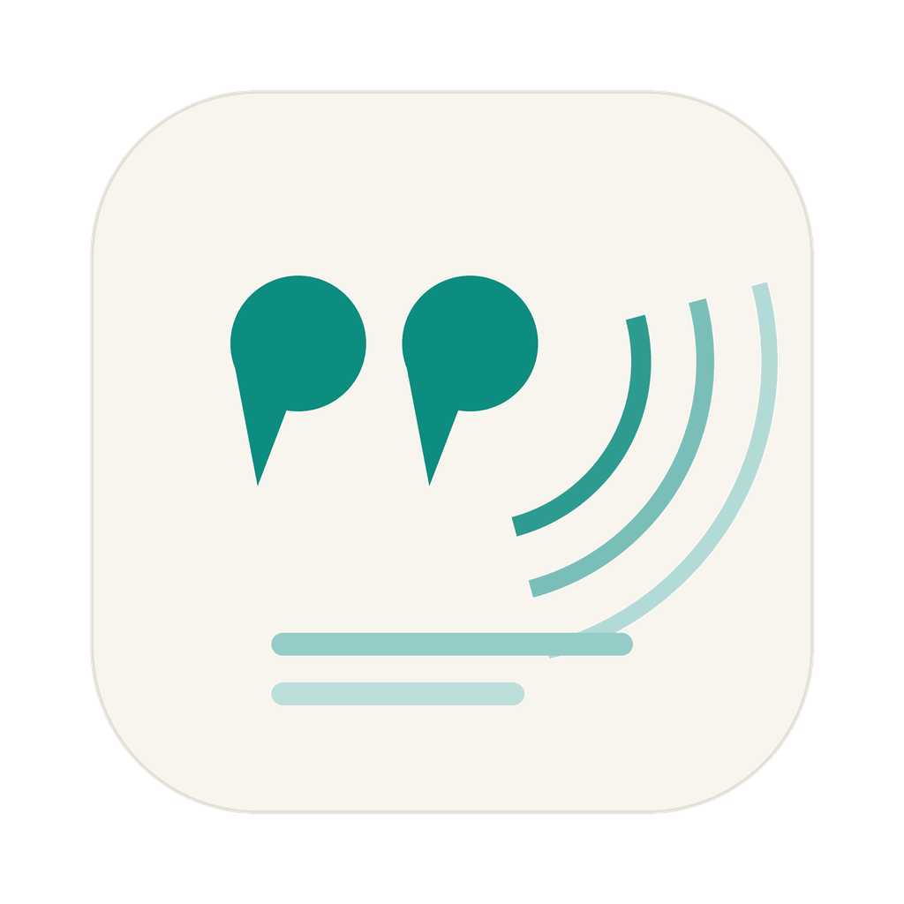

# EchoLine

An English reading and practice app for macOS. Save sentences from what you read, explore their meaning, and come back to them through listening, shadowing, and typing practice.

EchoLine is built with SwiftUI and AppKit. The interface and learning explanations are primarily in Chinese.

## What you can do

- Capture a word, sentence, or paragraph from another app with `Option + Command + E`.
- Preview selected text, listen to it, look up words, and choose what to save.
- Get AI explanations of sentence structure, tense, vocabulary, and paragraph connections.
- Build a searchable sentence library and vocabulary collection with tags and favorites.
- Practice with recordings, shadowing, dictation, and typing exercises.
- Revisit saved material through daily recall and review sessions.
- Use macOS voices or configure cloud speech synthesis.
- Optionally sync learning records through your own iCloud Drive.

## Build and run

Requirements: macOS 14 or later, and Xcode 16 or later with the macOS SDK.

```sh
git clone https://github.com/jiangcongxin/EchoLine.git
cd EchoLine
open EchoLine.xcodeproj
```

Select the **EchoLine** scheme and **My Mac**, then run with `Command + R`. If Xcode asks for signing, select your own development team in **Signing & Capabilities**. Change the bundle identifier if needed for your account.

To check the build without signing:

```sh
xcodebuild -project EchoLine.xcodeproj -scheme EchoLine \
  -configuration Debug -destination 'platform=macOS' \
  CODE_SIGNING_ALLOWED=NO build
```

## Configure AI and speech

Open **Settings** with `Command + ,` and enter your own provider API key. The default configuration uses Alibaba Cloud Bailian for text explanations and speech. DeepSeek, Kimi, and custom OpenAI-compatible text endpoints are also available in settings; speech can use Bailian, SiliconFlow, or macOS system voices.

Model availability and API charges depend on your provider. Use the connection and voice tests in settings to check your configuration.

For capture across apps, grant EchoLine **Accessibility** access in macOS System Settings. Microphone and speech recognition permissions are requested for recording and pronunciation practice.

## Data and privacy

The sentence library, vocabulary, recordings, and caches are stored locally. Optional synchronization uses the `EchoSync` folder in your iCloud Drive.

AI explanations send the submitted text to the provider you configure. Cloud speech and AI pronunciation features also send text or recordings as required by those features. API keys are currently stored in local app preferences (`UserDefaults`), rather than Keychain. Avoid submitting confidential material to cloud services.

## Source layout

```text
EchoLine/                  macOS app source and assets
EchoLine.xcodeproj/         Xcode project and shared scheme
```

This repository contains the macOS app. Build it from source; signed installers are not included in this initial release.

## Contributing

Bug reports and focused pull requests are welcome. For a bug, include your macOS and Xcode versions, steps to reproduce, and the provider/model if relevant. Remove API keys, personal sentences, and recordings from any attachments.

## License

MIT. See [LICENSE](LICENSE).
